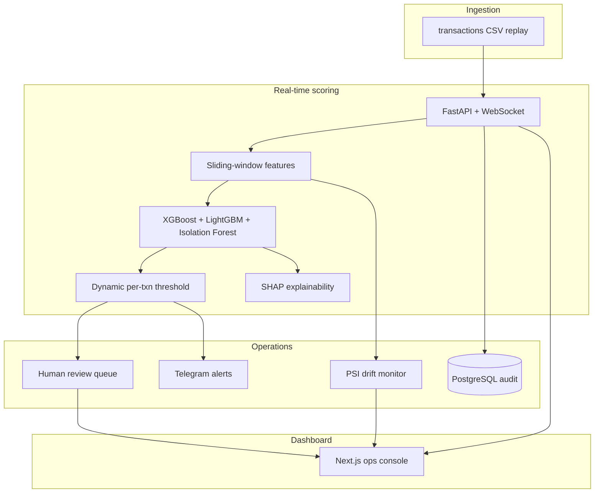

# RingWatch

**Real-time coordinated fraud ring detection for payment risk teams.**

Built for [Razorpay AI Buildathon 2026](https://razorpay.com/buildathon/) — **Track 02: AI Risk Manager**.

RingWatch scores every transaction in a live stream, explains *why* it was flagged, surfaces suspicious device/IP/address clusters, queues borderline cases for human review, monitors feature drift, and reports **honest held-out metrics** — no inflated live-replay numbers.

---

## Why judges should care

| What payment teams need | What RingWatch delivers |
|-------------------------|-------------------------|
| Catch **rings**, not lone anomalies | Ring-centric velocity features (device, IP, shared address) |
| Explain decisions to ops & regulators | Per-txn SHAP reasons + full audit trail |
| Balance fraud loss vs FP cost | **Dynamic thresholds** calibrated on validation — not a flat 0.5 |
| Trust the metrics | Single held-out evaluation + documented leakage audit |
| Act in real time | WebSocket dashboard, review queue, optional Telegram alerts |

---

## 60-second demo

```bash
git clone https://github.com/KolliparaVMKMithra/razorpay_buildathon.git
cd razorpay_buildathon
cp backend/.env.example backend/.env   # optional: add Telegram keys
docker compose up --build
```

| Service | URL |
|---------|-----|
| **Dashboard** | http://localhost:3001 |
| **API docs** | http://localhost:8001/docs |

1. Open the dashboard → click **Start** (30–40 tx/s).
2. Watch the **live transaction feed** and **suspicious entities** table populate.
3. Click a high-risk txn → inspect SHAP reasons.
4. **Approve / Reject** from the review queue (human-in-the-loop).
5. Open **Model Card** for held-out precision/recall (not live replay).

> Pre-trained models and datasets are included — no training step required for the demo.

---

## Held-out performance (single evaluation)

Evaluated **once** on `transactions_test_HELDOUT_v2.csv` — never tuned on test.  
Full report: [`ml/metrics_report.json`](ml/metrics_report.json)

| Metric | Value |
|--------|-------|
| **Precision** | **0.810** |
| **Recall** | **0.797** |
| **F1** | **0.803** |
| **ROC-AUC** | **0.979** |
| Dynamic threshold range | 0.42 – 0.82 |
| Confusion matrix | TP 47 · FP 11 · FN 12 · TN 3841 |

**Hard-negative false-positive rates (held-out):**

| Cluster type | FP rate |
|--------------|---------|
| family | 0% |
| hostel | 0% |
| office | 0% |
| cafe_wifi | 1.4% (1/71) |

**Known limitation (stated honestly):** Held-out fraud is 100% `fraud_card_testing`. Stolen-card burst and structuring appear in training + demo replay only. Live session metrics on the dashboard are replay labels — **not** used for reporting.

---

## Fraud patterns detected

1. **Card testing** — many small amounts, same device/IP, rapid burst, different users  
2. **Stolen-card burst** — mid/large amounts, different users, same shipping address  
3. **Structuring** — amounts clustered just under ₹10,000 review threshold  

---

## Architecture



---

## Tech stack

| Layer | Stack |
|-------|-------|
| ML | XGBoost, LightGBM, Isolation Forest, SHAP |
| Backend | FastAPI, WebSocket, SQLAlchemy, Redis |
| Frontend | Next.js 14, Tailwind CSS, Recharts |
| Infra | Docker Compose, PostgreSQL 16, Redis 7 |

---

## Key design decisions

- **Ring-centric features** — `txn_count_by_device_5min`, `distinct_users_per_address_60min`, etc. Target coordinated abuse.
- **Dynamic thresholds** — higher ₹ and stronger ring signal → lower review bar. Calibrated on train validation only.
- **Fixed IF calibration** — Isolation Forest normalized with train-time percentiles so live scores match offline evaluation.
- **Leakage audit** — [`ml/leakage_audit.md`](ml/leakage_audit.md): every feature verified knowable at score time; `cluster_type` never used as a feature.
- **Drift monitoring** — PSI on streaming features vs training baseline; alert when aggregate PSI > 0.2.
- **Defense-only** — detect, explain, queue for review. No payment execution or auto-block.

---

## Project structure

```
razorpay_buildathon/
├── data/           # Train, held-out test, full demo replay CSV
├── ml/             # Features, training, metrics, leakage audit, pre-trained models
├── backend/        # FastAPI API, stream engine, Postgres, Telegram
├── frontend/       # Next.js fraud ops dashboard
└── docker-compose.yml
```

---

## API reference

| Endpoint | Description |
|----------|-------------|
| `POST /api/stream/start` | Start transaction replay |
| `POST /api/stream/reset` | Reset session |
| `WS /api/ws/stream` | Live transaction + metrics feed |
| `GET /api/metrics/offline` | Held-out metrics report |
| `GET /api/metrics/live` | Current session metrics |
| `GET /api/dashboard/summary` | Entities, patterns, confusion matrix |
| `GET /api/drift/current` | PSI drift score |
| `GET /api/review-queue` | Borderline transactions |
| `POST /api/review-queue/{id}/approve` | Human approve |
| `POST /api/review-queue/{id}/reject` | Human reject |
| `GET /api/audit/{id}` | Full audit trail + SHAP reasons |

---

## Optional: Telegram alerts

1. Create a bot via [@BotFather](https://t.me/BotFather) → copy token  
2. Message your bot → get `chat_id` from `https://api.telegram.org/bot<TOKEN>/getUpdates`  
3. Add to `backend/.env`:
   ```
   TELEGRAM_BOT_TOKEN=your_token
   TELEGRAM_CHAT_ID=your_chat_id
   ```
4. `docker compose up -d backend`

Alerts fire on **review** and **flagged** transactions with amount, risk score, and top reasons.

---

## Local development (without Docker)

```bash
# 1. Train (optional — pre-trained models included)
cd ml && pip install -r requirements.txt && python train.py && cd ..

# 2. Infra
docker compose up postgres redis -d

# 3. Backend
cd backend && pip install -r requirements.txt
cp .env.example .env
python seed.py
uvicorn app.main:app --reload --port 8001

# 4. Frontend (new terminal)
cd frontend && npm install
NEXT_PUBLIC_API_URL=http://localhost:8001 NEXT_PUBLIC_WS_URL=ws://localhost:8001 npm run dev
```

Open http://localhost:3000 (dev) or use Docker on **3001 / 8001**.

**Sanity-check risk scores:**
```bash
python ml/scripts/score_sanity_check.py
```

---

## 5-minute pitch script

1. **Problem** — Fraud rings test cards, share addresses, structure amounts; single-txn rules miss them.  
2. **Live demo** — Start stream → suspicious entities → inspect txn → approve/reject.  
3. **Metrics** — Model Card: 0.81 precision on held-out test, 11 FPs documented.  
4. **Trust** — Leakage audit, drift monitor, dynamic thresholds, audit trail.  
5. **Limitation** — Held-out is card-testing only; defense-only, no auto-block.

---

## Team

**Kollipara VMK Mithra** — Razorpay AI Buildathon 2026

---

## License

MIT — see [LICENSE](LICENSE).
